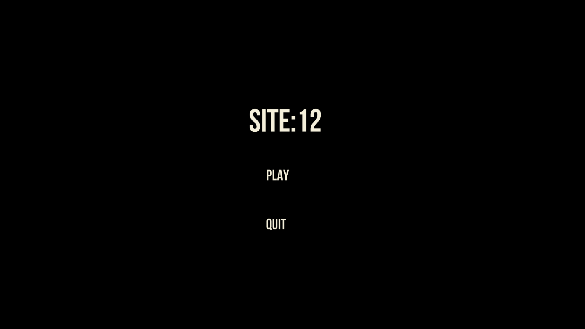
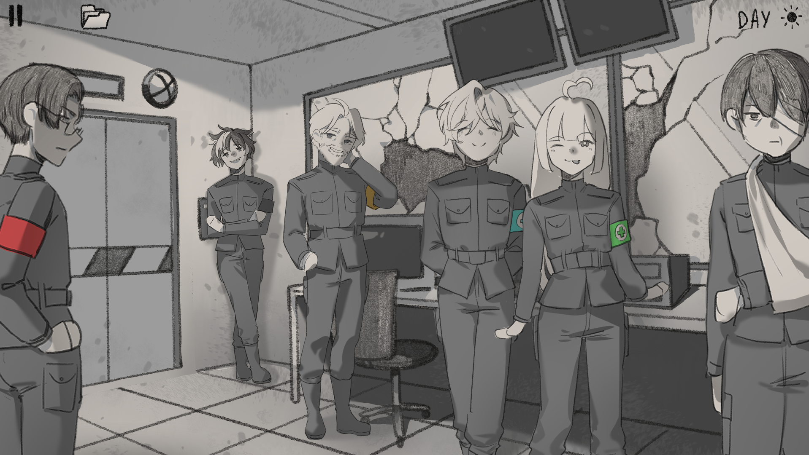
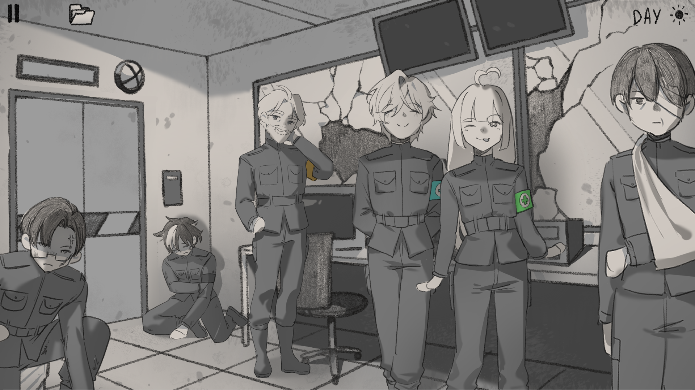
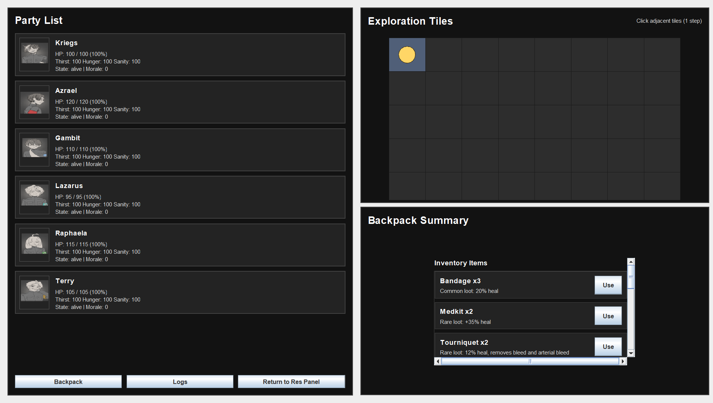
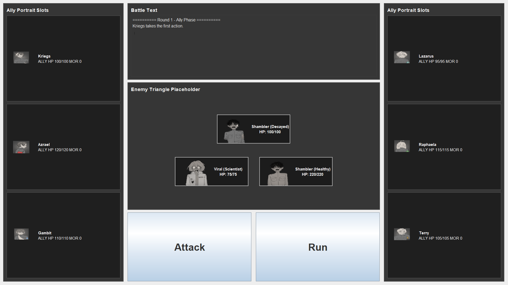
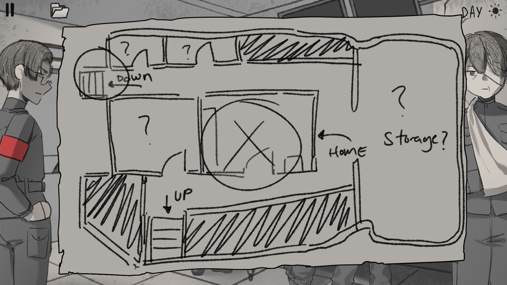

# ASPIRAS_BERMUDO_G14
Resource management game using Java

# Overview
Site 12 is a difficult turn-based, resource management survival game. You are not expected to survive your first few encounters as the game is built on being really difficult and unbalanced

For now, the main goal is to survive 

# How to clone and play locally
```
git clone https://github.com/capooo2224/ASPIRAS_BERMUDO_G14.git

```
And then open the repo folder using file manager and look for Site12.bat to play the game.

# How to play the game 
## Scavenging
Click on the door to enter scavenging mode. The player will be prompted to select where to go and pick which characters will enter that mode. There will be tiles on the right side wherein the player will have to move it to either get resources and find the exit although there would be chances of entering combat.

## Inventory
The inventory can be accessed on the main screen or in scavenge mode. On the main screen players may choose on who to use the item while in scavenge mode, the items will be used by who needs it the most.

# Controls

Top left of the screen is the pause button which you can restart a run and go back to the main menu

beside the pause button is the folder icon which, it's where you can acess the inventory and use items on your characters.

# Final build 

Main Menu


All characters Alive


Some characters almost dead


Scavenge Menu


Combat Menu


Map
